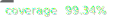

# accessibility-audit-core
[](https://www.npmjs.com/package/@consevangelou/accessibility-audit-core)

[](https://github.com/gieglas/accessibility-audit-core/actions/workflows/unit-test.yml)
[](https://github.com/gieglas/accessibility-audit-core/actions/workflows/tag-and-publish-on-version-change.yml)
[](coverage-summary.json)

Core utilities for automated web accessibility auditing.

This package provides **standards-aware processing** of accessibility findings, including:

- Conversion of automated tool output (e.g. axe-core)
- Normalisation and grouping of findings
- Mapping to WCAG / EN 301 549 criteria
- Severity and classification logic

It is **tool-agnostic** and **framework-agnostic** by design.

## What this package is (and is not)

### ✅ This package **does**

- Convert raw accessibility tool results into structured findings
- Align findings with WCAG / EN 301 549
- Provide consistent grouping and severity logic
- Bundle and load official accessibility standards

### ❌ This package **does not**

- Crawl websites
- Run browsers
- Persist results to disk
- Generate reports or dashboards
- Provide a CLI

Those concerns intentionally live in **separate projects**.

## Installation

```bash
npm install @consevangelou/accessibility-audit-core
```

## Basic usage

### Convert axe-core results into raw findings

```js
import { axeToRawFindings } from "@consevangelou/accessibility-audit-core";

const rawFindings = axeToRawFindings(axeResults, {
  auditRunId: "run-123",
  siteId: "example-site",
  pageId: "home",
  pageUrl: "https://example.com"
});
```

The `axeToRawFindings` function **always returns an array**. 
Each entry represents a **single violation on a single DOM node**.

If no violations are found, an empty array is returned.

Raw findings are intentionally tool-oriented and not suitable for direct compliance reporting.
They must be normalised before being used in WCAG or EN 301 549 assessments.

#### RawFinding schema

A RawFinding represents **one axe-core violation on one DOM node**.

```c#
{
  rawFindingId: string,
  auditRunId: string,
  siteId: string,
  pageId: string,
  pageUrl: string,

  source: string,          // e.g. "cli", "extension", "ci"
  tool: string,            // e.g. "axe-core"
  timestamp: ISODateString,

  ruleId: string,
  message: string,
  selector?: string,

  wcagTags: string[],
  impact?: "minor" | "moderate" | "serious" | "critical",

  findingType: "violation"
}
```

Raw findings should **never aggregated or altered**.

#### Example raw findings:

```json
[
  {
    "rawFindingId": "6c04cb29-580f-49f7-9a7d-6402c97e8a17",
    "auditRunId": "run-123",
    "siteId": "example-site",
    "pageId": "home",
    "pageUrl": "https://example.com",
    "source": "cli",
    "tool": "axe-core",
    "timestamp": "2025-12-30T17:26:13.218Z",
    "ruleId": "landmark-main-is-top-level",
    "message": "Ensure the main landmark is at top level",
    "selector": "#webchat",
    "wcagTags": [
      "cat.semantics",
      "best-practice"
    ],
    "impact": "moderate",
    "findingType": "violation"
  },
  {
    "rawFindingId": "8f79304d-ddb4-4575-aaf3-6af1a6d4d05a",
    "auditRunId": "run-123",
    "siteId": "example-site",
    "pageId": "home",
    "pageUrl": "https://example.com",
    "source": "cli",
    "tool": "axe-core",
    "timestamp": "2025-12-30T17:26:18.442Z",
    "ruleId": "label",
    "message": "Ensure every form element has a label",
    "selector": "#service-type-filter",
    "wcagTags": [
      "cat.forms",
      "wcag2a",
      "wcag412",
      "section508",
      "section508.22.n",
      "TTv5",
      "TT5.c",
      "EN-301-549",
      "EN-9.4.1.2",
      "ACT",
      "RGAAv4",
      "RGAA-11.1.1"
    ],
    "impact": "critical",
    "findingType": "violation"
  }
]

```

------------------

### Load an accessibility standard

Standards are bundled with the package.

```js
import { loadStandard } from "@consevangelou/accessibility-audit-core";

const standard = await loadStandard("EN301549_v3.2.1");
```

The returned object is a reference standard used during normalisation to:

- Validate WCAG success criteria
- Map findings to compliance requirements
- Ensure conservative, standards-aligned reporting

Currently supported:

- EN301549_v3.2.1 (WCAG 2.1)

#### Standard schema

```c#
{
  standardId: string,
  wcagVersion: string,

  criteria: {
    [wcagCriterionId: string]: {
      title: string,
      level: "A" | "AA" | "AAA",
      principle: string,
      enClause: string,
      userNeeds?: string[]
    }
  }
}
```

- `criteria` is keyed by WCAG success criterion ID (e.g. `"1.4.3"`)
- Only criteria present in this object are treated as **normative compliance targets**

### Example standard object (excerpt)

```json
{
  "standardId": "EN301549_v3.2.1",
  "wcagVersion": "2.1",
  "criteria": {
    "1.1.1": {
      "title": "Non-text Content",
      "level": "A",
      "principle": "Perceivable",
      "enClause": "9.1.1.1",
      "userNeeds": ["WV", "LV", "LC"]
    },
    "1.4.3": {
      "title": "Contrast (Minimum)",
      "level": "AA",
      "principle": "Perceivable",
      "enClause": "9.1.4.3",
      "userNeeds": ["LV", "LC"]
    },
    "4.1.2": {
      "title": "Name, Role, Value",
      "level": "A",
      "principle": "Robust",
      "enClause": "9.4.1.2"
    }
  }
}
```


------------------

### Normalise findings

```js
import { normaliseFindings } from "@consevangelou/accessibility-audit-core";

const normalised = normaliseFindings(rawFindings, standard);
```

This function converts low-level raw findings into **grouped, standards-aligned summaries**.

The result separates findings into two categories:

- **Compliance findings** — mapped to WCAG success criteria defined in the reference standard
- **Other findings** — best-practice or non-normative issues not mapped to WCAG

#### NormalisedFinding schema

A **NormalisedFinding** represents a grouped summary of one or more raw findings,
 suitable for reporting and analysis.

```c#
{
  auditRunId: string,
  siteId: string,
  pageId: string,
  pageUrl: string,

  wcagCriterionId: string | null // e.g. "1.4.3", "4.1.2"
  ruleId: string | null,

  classification: string        // e.g. "automated-violation",
  severity: "low" | "medium" | "high" | "critical",

  occurrenceCount: number,
  sourceRawFindingIds: string[]
}
```

#### Normalisation Grouping rules

- If a WCAG success criterion can be resolved **and exists in the reference standard**
   → the finding is grouped under **`compliance`**
- If no WCAG criterion is resolved
   → the finding is grouped under **`other`**

This separation ensures:

- **Conservative compliance reporting**
- **Clear distinction between normative and best-practice issues**
- **Stable aggregation across multiple tools and runs**

#### Example normalised finding

```json
{
  "compliance": [
    {
      "auditRunId": "run-123",
      "siteId": "example-site",
      "pageId": "home",
      "pageUrl": "https://example.com",
      "wcagCriterionId": "4.1.2",
      "ruleId": null,
      "classification": "automated-violation",
      "severity": "critical",
      "occurrenceCount": 1,
      "sourceRawFindingIds": [
        "8f79304d-ddb4-4575-aaf3-6af1a6d4d05a"
      ]
    }
  ],
  "other": [
    {
      "auditRunId": "run-123",
      "siteId": "example-site",
      "pageId": "home",
      "pageUrl": "https://example.com",
      "wcagCriterionId": null,
      "ruleId": "landmark-main-is-top-level",
      "classification": "automated-violation",
      "severity": "medium",
      "occurrenceCount": 1,
      "sourceRawFindingIds": [
        "6c04cb29-580f-49f7-9a7d-6402c97e8a17"
      ]
    }
  ]
}
```

------------------

## Output model (high-level)

Normalised findings are grouped by:

- WCAG Success Criterion (when applicable)
- Tool rule ID (for non-WCAG findings)

Each finding includes:

- WCAG criterion (or `null`)
- Severity
- Classification
- Occurrence count
- Traceability to raw findings

This structure is designed for:

- Compliance audits
- Aggregation
- Reporting pipelines
- Manual audit supplementation

## Compliance philosophy

This package follows a **conservative compliance model**:

- A finding is only treated as a compliance issue when it can be reliably mapped to a normative WCAG Success Criterion.
- Best-practice and advisory issues are preserved but explicitly separated.
- No automated claim of conformance is made.

Final compliance decisions **must always involve human judgment**.

For more detail, see `NOTES.md`.

## Intended consumers

This package is designed to be used by:

- CLI audit tools
- Browser extensions
- Continuous monitoring systems
- Internal government accessibility tooling

## Notes

- Empty arrays are always returned if no findings exist.
- Compliance findings are strictly WCAG-mapped.

## License

MIT © 2025 Constantinos Evangelou
